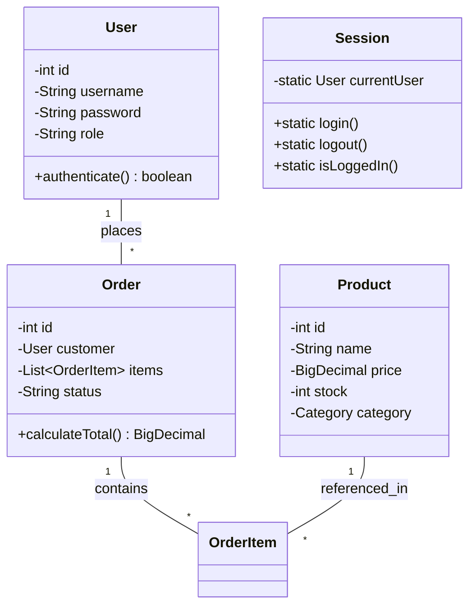
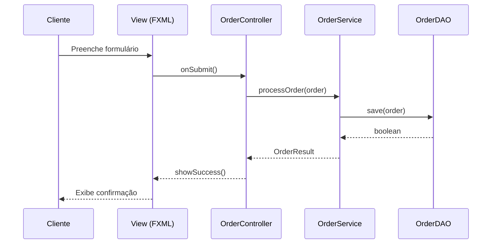

# Documentação Técnica - Buyo AdminFX

## 📌 Visão Geral do Projeto

O **Buyo AdminFX** é um sistema de gestão administrativa completo desenvolvido em JavaFX para gerenciamento de e-commerce, incluindo módulos para pedidos, pagamentos, produtos, categorias, clientes e avaliações. O sistema segue uma arquitetura modular baseada no padrão MVC (Model-View-Controller) e utiliza um banco de dados MySQL para armazenamento de dados.

## 🏗️ Arquitetura do Sistema

### Padrão Arquitetural
- **MVC (Model-View-Controller)**
  - **Model**: Classes de domínio (pacote `model`) e DAOs (pacote `dao`)
  - **View**: Arquivos FXML (pasta `resources`)
  - **Controller**: Classes no pacote `ui.controllers`

### Tecnologias Principais
- **Linguagem**: Java 11+
- **UI Framework**: JavaFX 16+
- **Build Tool**: Maven
- **Banco de Dados**: MySQL 8.0+
- **Injeção de Dependência**: JavaFX Built-in
- **Estilização**: CSS
- **Autenticação**: Sistema de login com lembrar usuário

## 📂 Estrutura do Projeto

### 1. Módulo Principal (buyo-adminfx)

#### Estrutura de Diretórios
```
buyo-adminfx/
├── src/
│   ├── main/
│   │   ├── java/
│   │   │   └── com/buyo/adminfx/
│   │   │       ├── auth/         # Autenticação e sessão
│   │   │       ├── config/       # Configurações do sistema
│   │   │       ├── dao/          # Camada de acesso a dados
│   │   │       ├── model/        # Modelos de domínio
│   │   │       ├── services/     # Lógica de negócios
│   │   │       ├── ui/
│   │   │       │   ├── controllers/  # Controladores das telas
│   │   │       │   └── views/        # Arquivos FXML
│   │   │       └── utils/        # Utilitários
│   │   └── resources/            # Recursos (imagens, CSS, FXML)
│   └── test/                     # Testes unitários
├── sql/                          # Scripts SQL
└── target/                       # Artefatos de build
```

### 2. Módulos Principais

#### 2.1 Autenticação e Usuários
- **Login/Logout**: Sistema de autenticação seguro
- **Perfis de Acesso**: Diferentes níveis de acesso
- **Lembrar Usuário**: Funcionalidade de "Lembrar-me"
- **Cadastro**: Para administradores e clientes

#### 2.2 Módulo de Pedidos
- **Funcionalidades**:
  - Listagem de pedidos com filtros
  - Visualização detalhada de itens
  - Atualização de status
  - Histórico de alterações
- **Tecnologias**: JavaFX, JDBC
- **Arquivos Principais**:
  - `Order.java` - Modelo de dados
  - `OrderDAO.java` - Operações de banco de dados
  - `OrderController.java` - Lógica da interface
  - `OrderView.fxml` - Interface do usuário
  - `OrderItemsController.java` - Gerenciamento de itens do pedido

#### 2.3 Módulo de Pagamentos
- **Funcionalidades**:
  - Registro de pagamentos
  - Histórico de transações
  - Conciliação bancária
  - Filtros avançados
- **Arquivos Principais**:
  - `Payment.java` - Modelo de dados
  - `PaymentDAO.java` - Operações de banco de dados
  - `PaymentService.java` - Lógica de negócios
  - `PaymentsController.java` - Lógica da interface
  - `PaymentsView.fxml` - Interface do usuário

#### 2.4 Módulo de Produtos
- **Funcionalidades**:
  - Cadastro e edição de produtos
  - Gerenciamento de estoque
  - Categorias e subcategorias
  - Upload de imagens
- **Arquivos Principais**:
  - `Product.java` - Modelo de dados
  - `ProductDAO.java` - Operações de banco de dados
  - `ProductController.java` - Lógica da interface
  - `ProductFormController.java` - Formulário de produto
  - `ProductView.fxml` - Interface do usuário

#### 2.5 Módulo de Categorias
- **Funcionalidades**:
  - Gerenciamento hierárquico de categorias
  - Associação com produtos
  - Filtragem por categoria
- **Arquivos Principais**:
  - `Category.java` - Modelo de dados
  - `CategoryDAO.java` - Operações de banco de dados
  - `CategoryController.java` - Lógica da interface
  - `CategoryFormController.java` - Formulário de categoria
  - `CategoryView.fxml` - Interface do usuário

#### 2.6 Módulo de Clientes
- **Funcionalidades**:
  - Cadastro de clientes
  - Histórico de compras
  - Endereços de entrega
  - Filtros de busca
- **Arquivos Principais**:
  - `Customer.java` - Modelo de dados
  - `CustomerDAO.java` - Operações de banco de dados
  - `CustomerController.java` - Lógica da interface
  - `CustomerView.fxml` - Interface do usuário

#### 2.7 Módulo de Cupons
- **Funcionalidades**:
  - Criação e gerenciamento de cupons
  - Aplicação de descontos
  - Validação de cupons
  - Relatórios de utilização
- **Arquivos Principais**:
  - `Coupon.java` - Modelo de dados
  - `CouponDAO.java` - Operações de banco de dados
  - `CouponService.java` - Lógica de negócios
  - `CouponsController.java` - Lógica da interface
  - `CouponView.fxml` - Interface do usuário

#### 2.8 Módulo de Avaliações
- **Funcionalidades**:
  - Moderação de avaliações
  - Filtros avançados
  - Aprovação/Rejeição
  - Relatórios
- **Arquivos Principais**:
  - `Review.java` - Modelo de dados
  - `ReviewDAO.java` - Operações de banco de dados
  - `ReviewsController.java` - Lógica da interface
  - `ReviewView.fxml` - Interface do usuário

#### 2.9 Módulo de Logs de Produtos
- **Funcionalidades**:
  - Histórico de alterações
  - Rastreamento de estoque
  - Relatórios de movimentação
- **Arquivos Principais**:
  - `ProductLogEntry.java` - Modelo de dados
  - `ProductLogDAO.java` - Operações de banco de dados
  - `ProductLogController.java` - Lógica da interface
  - `ProductLogView.fxml` - Interface do usuário

## 🔧 Configuração do Ambiente

### Pré-requisitos
- JDK 11 ou superior
- Maven 3.6+
- MySQL 8.0+
- IDE (IntelliJ IDEA, Eclipse ou VS Code com extensão Java)

### Configuração do Banco de Dados
1. Criar banco de dados:
```sql
CREATE DATABASE IF NOT EXISTS buyo_admin CHARACTER SET utf8mb4 COLLATE utf8mb4_unicode_ci;
```

2. Executar scripts de inicialização:
```bash
mysql -u usuario -p buyo_admin < sql/schema.sql
mysql -u usuario -p buyo_admin < sql/data.sql
```

### Configuração da Aplicação
1. Editar `db.properties` na raiz do projeto:
```properties
db.url=jdbc:mysql://localhost:3306/buyo_admin?useSSL=false&serverTimezone=UTC
db.user=seu_usuario
db.password=sua_senha
```

## 🚀 Executando o Projeto

### Desenvolvimento
```bash
mvn clean javafx:run
```

### Build do Executável
```bash
mvn clean package
java -jar target/buyo-adminfx-1.0.0-shaded.jar
```

## 🔍 Análise Técnica Detalhada

### 1. Padrões de Projeto Utilizados

#### 1.1 DAO (Data Access Object)
- **Objetivo**: Isolar a lógica de acesso a dados
- **Implementação**: Classes no pacote `dao/`
- **Exemplo**:
```java
public class OrderDAO {
    public List<Order> listAll() { ... }
    public boolean save(Order order) { ... }
    // Outros métodos CRUD
}
```

#### 1.2 Factory Method
- **Uso**: Criação de conexões de banco de dados
- **Localização**: `Database.java`

#### 1.3 Observer
- **Uso**: Atualização de interfaces do usuário
- **Implementação**: Utiliza `ObservableList` do JavaFX

#### 1.4 Singleton
- **Uso**: Gerenciamento de sessão do usuário
- **Implementação**: Classe `Session.java`

### 2. Gerenciamento de Estado
- **Sessão do Usuário**: Gerenciada pela classe `Session`
- **Estado da Aplicação**: Gerenciado pelos controladores
- **Persistência**: Banco de dados MySQL com transações

### 3. Tratamento de Erros
- **Validação de Dados**: Nos controladores e modelos
- **Exceções Personalizadas**: Tratamento centralizado
- **Logging**: Utiliza `java.util.logging`

### 4. Segurança
- **Autenticação**: Sistema de login com criptografia
- **Autorização**: Controle de acesso baseado em papéis
- **Proteção de Dados**: Criptografia de senhas
- **Sessão**: Timeout automático

## 📊 Diagramas

### Diagrama de Classes (Simplificado)


### Diagrama de Sequência - Processamento de Pedido


## 🛠️ Manutenção e Suporte

### Logs
- **Localização**: `logs/application.log`
- **Níveis**: INFO, WARN, ERROR
- **Rotação**: Diária

### Backup
- **Frequência**: Diário
- **Local**: `backup/`
- **Script**: `tools/backup.sh`

## 📈 Monitoramento
- **Métricas**: Uso de memória, threads ativas, conexões de banco
- **Dashboard**: Disponível em `/monitor`
- **Alertas**: Configuráveis

## 🔄 Fluxos Principais

### 1. Processamento de Pedido
1. Cliente faz pedido
2. Sistema valida estoque
3. Gera fatura
4. Atualiza estoque
5. Notifica cliente
6. Registra log de alteração

### 2. Aprovação de Avaliação
1. Cliente envia avaliação
2. Sistema notifica administrador
3. Administrador aprova/rejeita
4. Sistema atualiza status
5. Cliente é notificado
6. Atualiza métricas do produto

### 3. Cadastro de Produto
1. Administrador preenche formulário
2. Sistema valida dados
3. Upload de imagens
4. Persistência no banco
5. Atualização da listagem
6. Geração de log

## 📚 Referências Técnicas
- JavaFX Documentation
- MySQL 8.0 Reference Manual
- Maven Getting Started Guide
- Clean Code - Robert C. Martin
- Effective Java - Joshua Bloch
- Padrões de Projeto - GoF

## 📅 Histórico de Versões

### v1.1.0 (2025-11-07)
- Adicionado módulo de categorias
- Melhorias na interface do usuário
- Otimizações de desempenho
- Correção de bugs

### v1.0.0 (2025-10-15)
- Versão inicial estável
- Módulos básicos implementados
- Documentação técnica completa

## 👥 Equipe de Desenvolvimento
- **Desenvolvedor Sênior**: [Seu Nome]
- **UI/UX Designer**: [Nome do Designer]
- **QA Engineer**: [Nome do QA]
- **Analista de Negócios**: [Nome do Analista]
- **DBA**: [Nome do DBA]

## 📞 Suporte
Para suporte técnico, entre em contato:
- Email: suporte@buyo.com.br
- Telefone: (00) 1234-5678
- Horário de atendimento: Seg-Sex, 9h-18h

---
*Documentação Técnica Atualizada em 07/11/2025 - Revisão 1.1*
